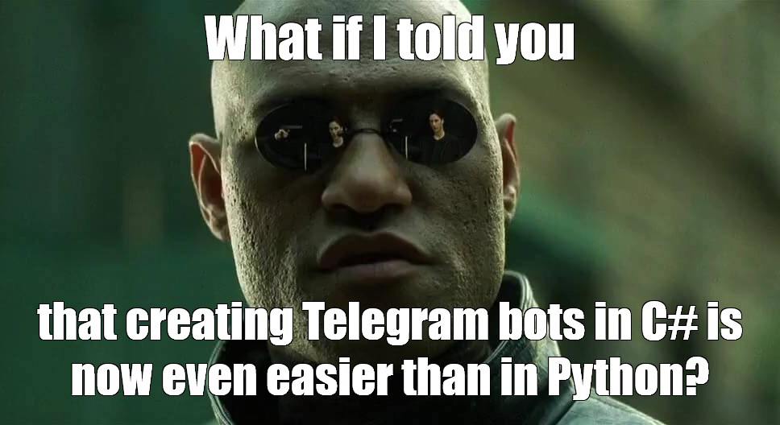

# Termigram

 [](https://www.nuget.org/packages/Telegram.Bot.Framework)
 [](https://raw.githubusercontent.com/pouladpld/Telegram.Bot.Framework/master/LICENSE)


The **simplest** way to build Telegram Bot in the whole multiverse 🤖

## Getting Started



Sometimes we just want to write code, run it and make it work. And this framework is just about it.

```csharp
public class MyBot : BotBase
{
    public MyBot(IOptions options) : base(options) { }

    [Command]
    public string Start() => "Hello, I'm bot";
}

...

_ = new MyBot(new DefaultOptions(token)).RunAsync();
```

Yep, no more<br>
Yep, so simple

Are you interested? Then, let's go!

## Library Details

 - This project is based on [Telegram.Bot](https://github.com/TelegramBots/Telegram.Bot) - the most popular and current wrapper over the Telegram Bot API, so there is a good chance that you're already partially familiar with what is under the hood of this framework

 - **.NET Standart 2.1+** (.NET Core 3.0+), cause I don't see this project without using such cool things as [`IAsyncEnumerable<T>`](https://docs.microsoft.com/en-us/dotnet/api/system.collections.generic.iasyncenumerable-1?view=netcore-3.1) (I'll show some use cases later)

 - This library already uses the **Nullable feature**, so it will be easier for you to understand where null is a valid value and where it's not

 - Alas, I had no enough time to write documentation for this project yet 😕 I'll fix this in the nearest future, but for now I hope that an example will be enough to bring you up to date

## Example

Since the library doesn't have any documentation yet, I'll try to explain the [example](https://github.com/Kir-Antipov/Termigram/tree/master/Termigram.Example) as intelligibly as possible so that you can understand what is going on here :)

Let's take a look at creating a simple bot step by step at first:

### 0. Create a new class

```csharp
public class TestBot
{

}
```

### 1. Inherit it from one of the base classes

There're 2 default base classes available: [`BotBase`](https://github.com/Kir-Antipov/Termigram/tree/master/Termigram/Bot/BotBase.cs) and [`StateBotBase`](https://github.com/Kir-Antipov/Termigram/tree/master/Termigram/Bot/StateBotBase.cs). The last one has special `State` property, which can be used to store some user-specific data between command calls, that’s the whole difference.

So your class will be look like

```csharp
public class TestBot : BotBase
{
    public TestBot(IOptions options) : base(options) { }
}
```

or

```csharp
public class TestBot : StateBotBase
{
    public TestBot(IStateOptions options) : base(options) { }
}
```

### 2. Create a command

By default, any method *(static, instance, public or non public)* that is tagged with the [`CommandAttribute`](https://github.com/Kir-Antipov/Termigram/tree/master/Termigram/Commands/CommandAttribute.cs) attribute is a command.

```csharp
public class TestBot : StateBotBase
{
    public TestBot(IStateOptions options) : base(options) { }

    [Command("start", "begin")]
    public string Start() => "Hi, I'm bot";
}
```

This mean that our bot has one command, which can be triggered somehow like this:

> /start<br>
> /begin<br>
> start<br>
> begin<br>
> StArt 42<br>
> BEGIn foo

Command name is case insensitive and it's not required to start it with slash.

### 3. BotAttribute

I marked my [example class](https://github.com/Kir-Antipov/Termigram/tree/master/Termigram.Example/TestBot.cs) with [`BotAttribute`](https://github.com/Kir-Antipov/Termigram/tree/master/Termigram/Bot/BotAttribute.cs):

```csharp
[Bot(Bindings.AnyPublic)]
public class TestBot : StateBotBase
```

This overrides the behavior of [default `ICommandExtractor`](https://github.com/Kir-Antipov/Termigram/tree/master/Termigram/CommandExtractors/DefaultCommandExtractor.cs). Now, as any public method will be tagged as a command, there's no need to use [`CommandAttribute`](https://github.com/Kir-Antipov/Termigram/tree/master/Termigram/Commands/CommandAttribute.cs) anymore, so these lines of code become identical:

```csharp
public string Start() => ...

[Command]
public string Start() => ...

[Command("Start")]
public string Start() => ...
```

### 4. IgnoreCommandAttribute

If you don't want some method to become a command in any cases, just mark it with [`IgnoreCommandAttribute`](https://github.com/Kir-Antipov/Termigram/tree/master/Termigram/Commands/IgnoreCommandAttribute.cs):

```csharp
[IgnoreCommand]
public void NotCommand() => ...
```

### 5. DefaultCommandAttribute

If you want your bot to respond by a prepared message in cases where the user hasn't called any of available commands, just mark one of the methods by [`DefaultCommandAttribute`](https://github.com/Kir-Antipov/Termigram/tree/master/Termigram/Commands/DefaultCommandAttribute.cs):

```csharp
[DefaultCommand]
public static string Default() => "Sorry, I have no such command";
```

### 6. Available return types

The value returned by the method processes using one of the [`IResultProcessors`](https://github.com/Kir-Antipov/Termigram/tree/master/Termigram/ResultProcessors/). Here's the list of types that can be processed by default:

- `string`
- `ChatAction`
- [`AnimationMessage`](https://github.com/Kir-Antipov/Termigram/tree/master/Termigram/Messages/AnimationMessage.cs)
- [`AudioMessage`](https://github.com/Kir-Antipov/Termigram/tree/master/Termigram/Messages/AudioMessage.cs)
- [`ChatActionMessage`](https://github.com/Kir-Antipov/Termigram/tree/master/Termigram/Messages/ChatActionMessage.cs)
- [`ContactMessage`](https://github.com/Kir-Antipov/Termigram/tree/master/Termigram/Messages/ContactMessage.cs)
- [`DocumentMessage`](https://github.com/Kir-Antipov/Termigram/tree/master/Termigram/Messages/DocumentMessage.cs)
- [`GameMessage`](https://github.com/Kir-Antipov/Termigram/tree/master/Termigram/Messages/GameMessage.cs)
- [`LocationMessage`](https://github.com/Kir-Antipov/Termigram/tree/master/Termigram/Messages/LocationMessage.cs)
- [`MediaGroupMessage`](https://github.com/Kir-Antipov/Termigram/tree/master/Termigram/Messages/MediaGroupMessage.cs)
- [`PhotoMessage`](https://github.com/Kir-Antipov/Termigram/tree/master/Termigram/Messages/PhotoMessage.cs)
- [`PollMessage`](https://github.com/Kir-Antipov/Termigram/tree/master/Termigram/Messages/PollMessage.cs)
- [`StickerMessage`](https://github.com/Kir-Antipov/Termigram/tree/master/Termigram/Messages/StickerMessage.cs)
- [`TextMessage`](https://github.com/Kir-Antipov/Termigram/tree/master/Termigram/Messages/TextMessage.cs)
- [`VenueMessage`](https://github.com/Kir-Antipov/Termigram/tree/master/Termigram/Messages/VenueMessage.cs)
- [`VideoMessage`](https://github.com/Kir-Antipov/Termigram/tree/master/Termigram/Messages/VideoMessage.cs)
- [`VideoNoteMessage`](https://github.com/Kir-Antipov/Termigram/tree/master/Termigram/Messages/VideoNoteMessage.cs)
- [`VoiceMessage`](https://github.com/Kir-Antipov/Termigram/tree/master/Termigram/Messages/VoiceMessage.cs)

Any value could be wrapped with `Task`, `Task<T>`, `IEnumerable`, `IEnumerable<T>` and `IAsyncEnumerable<T>`. So feel free to write asynchronous code and return more then 1 value from the method:

```csharp
// This command will send 2 messages to its invoker
[Command("values")]
public IEnumerable<string> GetValues()
{
    yield return "0";
    yield return "1";
}

// This command will send 2 messages with a 1 second break to its invoker
[Command("valuesdelay")]
public async IAsyncEnumerable<string> GetValuesAsync()
{
    yield return "0";
    await Task.Delay(1000);
    yield return "1";
}

// This command will send 1 message with text "Hello!" to the chat with id 1
// (not to its invoker)
[Command("send")]
public async Task<TextMessage> SendAsync()
{
    await SomeWorkAsync();
    return new TextMessage("Hello!", chatId: 1); 
}
```

### 7. Parameters

```csharp
public string Sum(int a, int b, int c = 1) => $"Sum of *{a}*, *{b}* and *{c}* is {a + b + c}";
```

As you can see, there's an ability to pass parameters to the method by invoking a command. 

> /sum<br>
> Sum of **0**, **0** and **1** is 1<br><br>
> /sum 2<br>
> Sum of **2**, **0** and **1** is 3<br><br>
> /sum 3 5 2<br>
> Sum of **3**, **5** and **2** is 10

There're some special values which can be provided by [`ISpecialValueProvider`](https://github.com/Kir-Antipov/Termigram/tree/master/Termigram/SpecialValueProviders/ISpecialValueProvider.cs)s:

 - (`User` *anyName*) - user who called the command
 - (`ChatId` *anyName*) - Id of the chat from which the message came. If chat id isn't available, user id will be returned
 - (`Update` *anyName*) - `Update` object associated with this command
 - (`Message` *anyName*) - `Message` object associated with this command
 - (`ICommand` *anyName*) - this command info

### 8. Exceptions

Each exception is perceived as a user error, not an error of your code, since from a semantic point of view it was the user who could call the command in a wrong way. So these commands

```csharp
[Command]
public void EnterPrivateZone() => throw new UnauthorizedAccessException("Sorry, you're blacklisted!");

[Command]
public async Task EnterPrivateZoneAsync() => throw new UnauthorizedAccessException("Sorry, you're blacklisted!");
```

will send an error message to the user who invoked the command.

If you don't like this behavior, you can change it by providing another [`IResultProcessor`](https://github.com/Kir-Antipov/Termigram/tree/master/Termigram/ResultProcessors/IResultProcessor.cs) for `Exception` objects instead of [`ExceptionProcessor`](https://github.com/Kir-Antipov/Termigram/tree/master/Termigram/ResultProcessors/ExceptionProcessor.cs)

### 9. Helpful methods

[`BotBase`](https://github.com/Kir-Antipov/Termigram/tree/master/Termigram/Bot/BotBase.cs) has some helpful methods for inherited classes:

 - `WaitForUpdateAsync` - The execution of the method will continue only after receiving a response from the user. In case of cancellation request `null` will be returned (by default there's 10 minutes timeout).
 - `WaitForAnswerAsync` - The same as `WaitForUpdateAsync`, but it returns only text from `Update` object:
 
 ```csharp
public async IAsyncEnumerable<TextMessage> Lucky(User user)
{
    const int min = 1;
    const int max = 10;

    int guessed = new Random().Next(min, max + 1);

    yield return "Let's see how lucky you are!";
    yield return $@"I've made a number from *{min}* to *{max}*\. Try to guess it\!";

    string? userAssumption = await WaitForAnswerAsync(user);

    if (string.IsNullOrEmpty(userAssumption))
        throw new TimeoutException("Sorry, but you haven't answered for too long. Let's play next time!");

    if (userAssumption.Trim() == guessed.ToString())
    {
        yield return "Lucky guy!";
    }
    else
    {
        yield return $@"This time you're out of luck\. I figured out the number *{guessed}*";
    }
}

```
 
 - `GenerateReplyKeyboardMarkup` - Generates `ReplyKeyboardMarkup` by command methods' names:
```csharp
MainMenu = GenerateReplyKeyboardMarkup
(
    nameof(Lucky),  nameof(Memento),
    nameof(Sum),    nameof(Sticker),
            nameof(Help)
);
```
 - `GenerateInlineKeyboardMarkup` -  Generates `InlineKeyboardMarkup` by command methods' names

### 10. Starting the bot

When your bot is ready, it remains just to create an instance of it and call the `RunAsync` method :)

```csharp
string token = "token";
IStateOptions options = new DefaultStateOptions(token);
IBot bot = new TestBot(options);

CancellationTokenSource source = new CancellationTokenSource();
_ = bot.RunAsync(source.Token);

Console.WriteLine("Press any key to stop the bot...");
Console.ReadKey();

source.Cancel();
```

## TODO

 [ ] Documentation